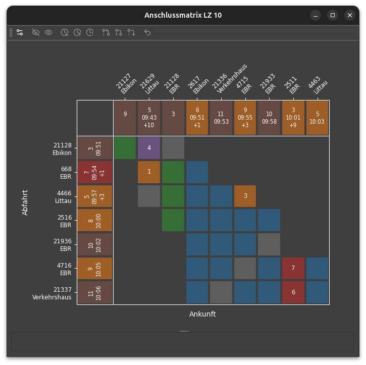

# Anschlussmatrix

Die Anschlussmatrix zeigt den Status der Umsteigeverbindungen.
Dies sind Relationen zwischen Ankünften und Abfahrten in einem Bahnhof, 
die fahrplanmässig innerhalb eines bestimmten Zeitfensters liegen.
Die Zeit zwischen Ankunft und Abfahrt muss länger als die benötigte Umsteigezeit und kürzer als die maximale Anschlusszeit sein.

Auf der waagrechten Achse werden die ankommenden Züge angezeigt,
auf der senkrechten die abfahrenden.
Neben der Zugnummer steht die Herkunft bzw. das Ziel des Zuges.
In der Regel ist dies ein Uebergabegleis von/zu einem anderen Stellwerk.

In der Zugleiste werden ausserdem das disponierte Gleis, die Ankunfts- bzw. Abfahrtszeit sowie die Verspätung angezeigt.
Die Farben der Felder entsprechen hier den konfigurierten Zugfarben.

## Matrixfelder

Zu jedem Zugpaar gibt es ein Feld in der Matrix.
Die Farben haben folgende Bedeutung:

- blau: Anschluss wird voraussichtlich erfüllt.
- grün: Anschluss wurde erfüllt, der Zug kann abfahren.
- rot: Die Umsteigezeit reicht nicht, um den Anschluss zu gewährleisten.
    Hier muss der Fdl eine Entscheidung treffen.
- rosa: Kupplung, der Zug muss auf den zweiten Zugteil warten.
- orange: Fdl-Entscheid: Der Anschluss wird abgewartet.
- violett: Fdl-Entscheid: Der Anschluss wird gebrochen.
- grau: Gleicher Zug. Flügelungen sind an zwei grauen Feldern in einer Spalte erkennbar.

Die Zahl in den Feldern gibt die Verspätung an, die der Zug bekommt, wenn er den Anschluss abwartet.

## Beispiel

Aus der oben gezeigten Matrix kann mal also unter anderem herauslesen:

- Zug 21128 wartet den verspäteten 21629 nicht ab. Weil der 21127 planmässig angekommen ist, kann der 21128 abfahren.
- Zug 668 wartet eine Minute länger auf den Anschluss vom 21629.
- Die Passagiere von Zug 21128 hatten genug Zeit, ihre Anschlusszüge zu erreichen.
- Alle Anschlüsse von Zug 2516 werden voraussichtlich erfüllt. Sobald die Zeile grün ist, darf er abfahren.
- Ueber die Anschlüsse von 4716 und 21337 wurde noch nicht entschieden. Falls der 21337 wartet, wird er eine Abgangsverspätung von 6 Minuten erhalten. (Der 4716 muss nicht warten, weil er in die gleiche Richtung zurück fährt.) 

 
## Werkzeuge

Einer oder mehrere Anschlüsse werden durch Klicken auf die farbigen Felder oder die Zugbeschriftung ausgewählt.
Klicken auf den Hintergrund löscht die Auswahl.
Auf ausgewählte Anschlüsse können folgende Aktionen der Werkzeugleiste angewendet werden.
Alle Aktionen haben ein Tastaturkürzel.
Das Kürzel wird im Tooltip angezeigt.

- :bootstrap-actionZugAusblenden: Zug ausblenden
- :bootstrap-actionZugEinblenden: Alle Züge einblenden
- :bootstrap-actionAnkunftAbwarten: [Ankunft abwarten (Anschluss abwarten)](dispo.md#ankunft-abwarten-anschluss-abwarten)
- :bootstrap-actionAbfahrtAbwarten: [Abfahrt abwarten (Überholung)](dispo.md#abfahrt-abwarten-uberholung)
- :bootstrap-actionAnschlussAufgeben: Anschluss aufgeben
- :bootstrap-actionLoeschen: [Anschlussstatus zurücksetzen](dispo.md#befehl-zurucknehmen)
- :bootstrap-actionPlusEins:/:bootstrap-actionMinusEins: [Wartezeit verlängern/verkürzen](dispo.md#wartezeit-verlangernverkurzen)

Die Ankunft/Abfahrt abwarten-Befehle erstellen wie die gleichnamigen Befehle in den anderen Modulen einen Abhängigkeitseintrag im Dispositionsjournal.
Dadurch wird die Verspätung entlang des Zuglaufs entsprechend hochgerechnet und in den anderen Modulen nachgeführt.

Der Befehl _Anschluss aufgeben_ betrifft nur die Darstellung der Matrix und hat keinen Einfluss auf den Betrieb.

## :bootstrap-actionSetup: Einstellungen

Da der Stellwerksim-Fahrplan keine Kategorie _Anschluss_ enthält, 
bestimmt `stsDispo` mögliche Anschlüsse aus der Differenz zwischen Ankunfts- und Abfahrtszeit einer Relation.
Einerseits muss diese Differenz grösser als die minimale _Umsteigezeit_ in einem Bahnhof sein.
Dieser Wert ist vor allem für die Fahrgäste entscheidend.
Andererseits werden Relationen über der _Anschlusszeit_ nicht in der Matrix dargestellt, damit die Matrix überschaubar bleibt.
Die Anschlusszeit kann z.B. auf das halbe Taktintervall gestellt werden.

Wenn gewisse Zugkategorien wie z.B. S-Bahnen keine Anschlüsse garantieren,
können diese aus der Matrix ausgeschlossen werden.
