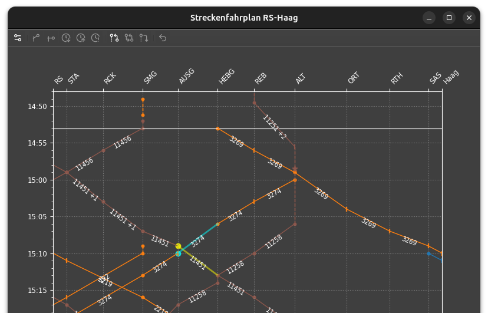
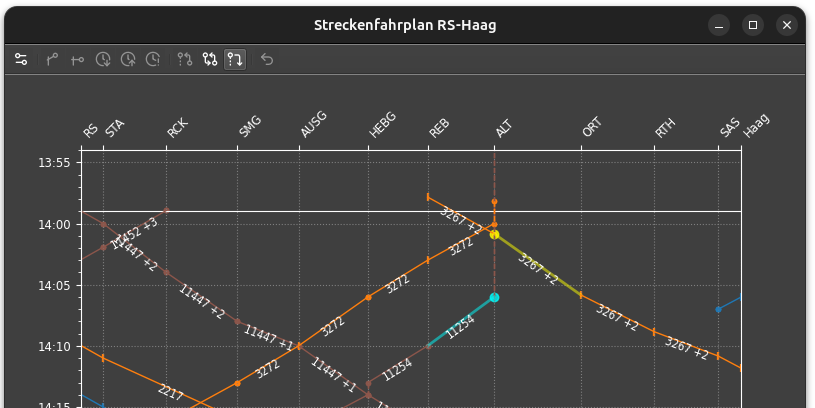
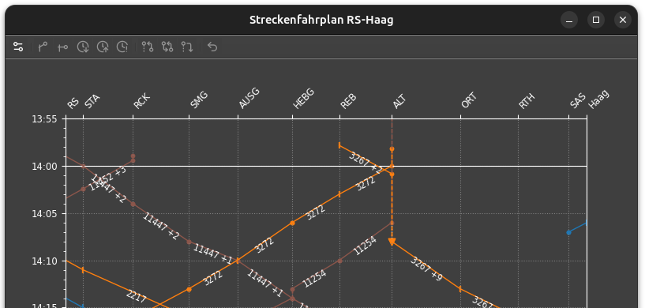
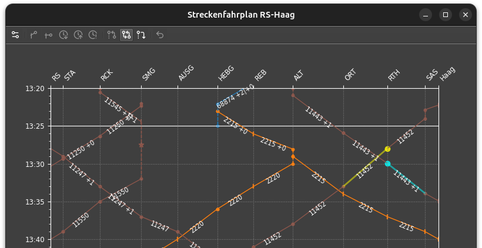
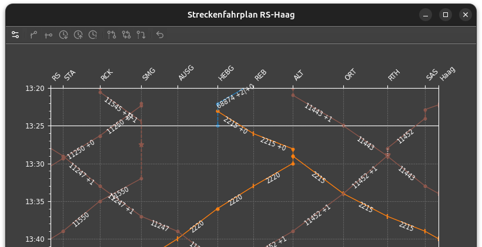
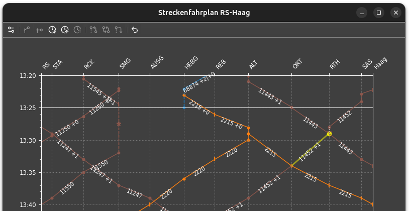
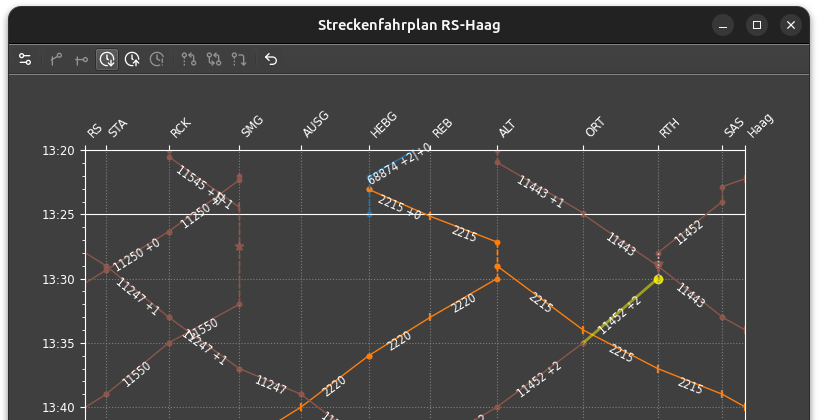
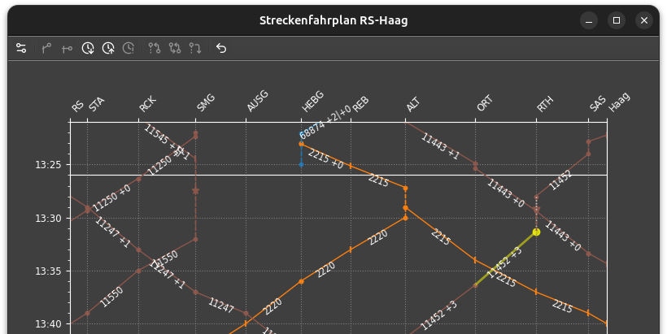
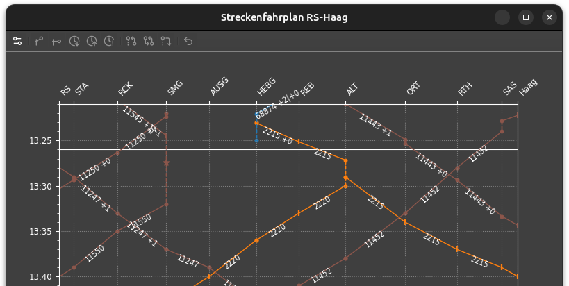

# Disposition

Die planmässige Disposition von Zügen auf Gleise und Trassen ist im Stellwerksim vom Fahrplan vorgegeben.
Insbesondere bei Verspätungen muss diese Disposition vom Fahrdienstleiter geändert werden.
Dispositionsänderungen können in STSdispo mit einer Reihe von Korrekturbefehlen geplant werden,
um die Auswirkungen auf andere Züge zu untersuchen.
STSdispo ist dabei nur ein Planungswerkzeug, die einzelnen Änderungen muss der Spieler selber im Stellwerk umsetzen.

## :bootstrap-actionAnkunftAbwarten: Ankunft abwarten / Anschluss abwarten

- Zug 1 wartet auf die Ankunft von Zug 2.
- Zug 1 wartet auf Anschlusspassagiere von Zug 2.
- Zug 1 wartet auf freies Gleis von Zug 2.

Wenn Zug 1 eine Durchfahrt hat, wird ein Betriebshalt befohlen.

Verfügbar in: [Streckenfahrplan], [Gleisbelegung], [Anschlussmatrix]

### Beispiel

SMG-AUSG-HEBG ist eine eingleisige Strecke mit Ausweichstelle.
Zug 11451 muss die Ankunft von 3274 abwarten.

Zum Auswählen des wartenden Zugs 11451 in der Nähe von AUSG auf seine abgehende Trasse klicken.
Zum Auswählen des abzuwartenden Zugs 3274 in der Nähe von AUSG auf seine eingehende Trasse klicken.

Die Abgangsverspätung passt sich dynamisch an die aktuelle Verspätung von 3274 an.
Der Dispositionsbefehl wird durch ein Dreieck und eine gepunktete Linie angezeigt.

## :bootstrap-actionAbfahrtAbwarten: Abfahrt abwarten / Überholung

- Zug 1 wartet auf die Abfahrt von Zug 2.
- Zug 2 überholt Zug 1.

Wenn Zug 1 eine Durchfahrt hat, wird ein Betriebshalt befohlen.

Verfügbar in: [Streckenfahrplan], [Gleisbelegung]

### Beispiel

Zug 3267 soll in ALT die Abfahrt von 11254 abwarten. 

Zum Auswählen der Züge in der Nähe von ALT auf ihre abgehenden Trassen klicken.
Der erstgewählte Zug wartet auf den zweitgewählten.

Der Dispositionsbefehl wird durch ein Dreieck und eine gepunktete Linie (im Beispiel verdeckt) angezeigt.

## :bootstrap-actionKreuzung: Zugkreuzung

- Zwei Züge warten gegenseitig ihre [Ankunft](#ankunft-abwarten-anschluss-abwarten) ab.
- Der frühere Zug wartet auf die Ankunft des späteren Zugs.
- Zugkreuzung auf eingleisiger Strecke mit Ausweichstelle.

Für die Züge, die eine Durchfahrt haben, wird ein Betriebshalt befohlen.

Dieser Befehl ist ähnlich wie [Ankunft abwarten](#ankunft-abwarten-anschluss-abwarten),
wirkt aber symmetrisch auf beide Züge.
Er kann verwendet werden, wenn noch unklar ist, welcher Zug zuerst ankommen wird.

Verfügbar in: [Streckenfahrplan], [Gleisbelegung]

### Beispiel

ORT-RTH-SAS ist eine eingleisige Strecke mit Ausweichstelle.
Die Züge 11443 und 11452 kreuzen in RTH.
Weil einer der Züge eine Verspätung hat, muss der andere warten.

Zum Auswählen der Züge in der Nähe von RTH auf ihre abgehenden Trassen klicken.

Die Abgangsverspätung passt sich dynamisch an die aktuelle Lage an.
Der Dispositionsbefehl wird durch das Dreieck und die gepunktete Linie angezeigt.

## :bootstrap-actionBetriebshaltEinfuegen: Betriebshalt einfügen

- Der Zug erhält einen ausserplanmässigen Halt statt Durchfahrt.
- Der Zug hält an einem im Fahrplan nicht verzeichneten Bahnhof.
    - Der Fdl gibt das Gleis vor, an dem angehalten wird.
    - Der Fdl stellt sicher, dass der Zug effektive die Strecke mit dem gewählten Halt befährt.

Im letzteren Fall muss der Fdl sicherstellen, dass der Zug effektiv die Strecke mit der gewählten Bst befährt.
STSdispo kann dies nicht überprüfen.

STSdispo trägt eine minimale Aufenthaltsdauer ein.
Wird eine besondere Abfahrtszeit gewünscht, muss ein zusätzlicher Befehl wie 
[Ankunft](#ankunft-abwarten-anschluss-abwarten), 
[Abfahrt](#abfahrt-abwarten-uberholung) abwarten,
[Wartezeit](#wartezeit-verlangern) oder
[Abfahrtszeit](#fixe-abfahrtszeit-eintragen) erteilt werden.

Verfügbar in: [Streckenfahrplan]

## :bootstrap-actionVorzeitigeAbfahrt: Vorzeitige Abfahrt

- Der Zug fährt vor der geplanten Abfahrtszeit ab (gem. entsprechendem Funkbefehl im STS).

STSdispo setzt die Abfahrtszeit auf die frühestmögliche Zeit.

Wird eine besondere Abfahrtszeit gewünscht, muss ein zusätzlicher Befehl wie 
[Ankunft](#ankunft-abwarten-anschluss-abwarten), 
[Abfahrt](#abfahrt-abwarten-uberholung) abwarten,
[Wartezeit](#wartezeit-verlängern) oder
[Abfahrtszeit](#fixe-abfahrtszeit-eintragen) erteilt werden.

Verfügbar in: [Streckenfahrplan]

## :bootstrap-actionPlusEins:/:bootstrap-actionMinusEins: Wartezeit verlängern/verkürzen

- Die Abfahrt an einem planmässigen Halt verzögert sich.
- Die Wartezeit nach einem [Ankunft-](#ankunft-abwarten-anschluss-abwarten) oder [Abfahrt-](#abfahrt-abwarten-uberholung)Wartebefehl verlängert sich.
 
Verfügbar in: [Streckenfahrplan], [Gleisbelegung], [Anschlussmatrix]

### Beispiel

Der Zug 11452 soll in RTH eine zusätzliche Wartezeit erhalten.

Zum Auswählen des Zuges in der Nähe von RTH auf seine abgehende Trasse klicken.

!!! note "Achtung"
    Die früheste Abfahrtszeit wird auch vom Fahrplan bestimmt.
    Je nachdem hat der Befehl keine sichtbare Auswirkung.

## :bootstrap-actionLoeschen: Befehl zurücknehmen

- Die Betriebslage hat sich geändert, die Korrekturen sind nicht mehr gültig.
- Die Disponierung des Zuges soll neu erfasst werden. 

Es werden alle Dispobefehle eines Zuges zu einem bestimmten Fahrplanpunkt zurückgesetzt.

Verfügbar in: [Streckenfahrplan], [Gleisbelegung], [Anschlussmatrix], [Zugfahrplan] (Reiter _Dispo_).

### Beispiel

Der Zug 11452 hat eine befohlene Wartezeit in RTH.
Weil sich die Betriebslage geändert hat, wird der Befehl zurückgenommen.

Zum Auswählen des Zuges in der Nähe von RTH auf seine abgehende Trasse klicken.

Die Kreuzung- wie auch die Wartezeit-Befehle wurden zurückgenommen.
Die Betriebslage wird wieder unverändert dargestellt.

[Streckenfahrplan]: streckenfahrplan.md
[Gleisbelegung]: gleisbelegung.md
[Anschlussmatrix]: anschlussmatrix.md
[Zugfahrplan]: zugfahrplan.md
