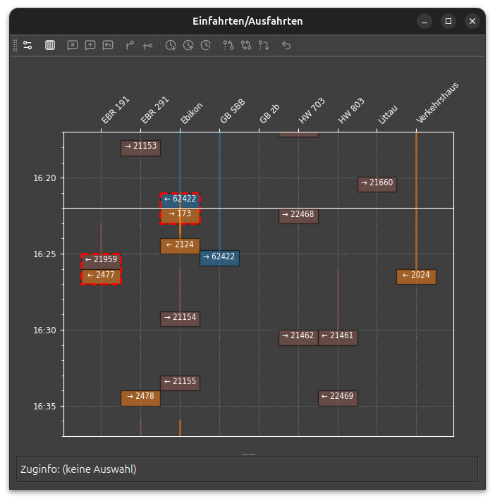

# Ein-/Ausfahrten

Das Einfahrts- und Ausfahrtsdiagramm zeigt die Belegung der Ein- und Ausfahrtsgleise
ähnlich wie das [Gleisbelegungsdiagramm](gleisbelegung.md) der Bahnhofgleise.

Die Fahrpläne im Stellwerksim haben keine definierten Einfahrts- und Ausfahrtszeiten.
Die Fahrpläne enhalten lediglich die Ankunfts-/Abfahrtszeit am nächsten Fahrplanpunkt.
STSdispo schätzt die Einfahrts- und Ausfahrtszeit anhand gemessener Fahrzeiten.
Die Schätzung wird daher im Lauf des Spiels besser.

## Markierungen

- Belegung der Ein- und Ausfahrgleise in Balkendarstellung.
    - Pfeil links zeigt Einfahrt, Pfeil rechts Ausfahrt
    - Linie zeigt die Verspätung (max. 15 Minuten, gestrichelt wenn länger) an.
    - Die Belegungsdauer ist standardmässig 1 Minute lang.
    - Ueberlappende Belegungen werden in willkürlicher Reihenfolge gestaffelt.
- Konflikte:
    - Gleiskonflikte (dicker, roter Rahmen): Der Sim meldet eine mögliche Doppelbelegung.
        Bei Ein-/Ausfahrgleisen mit gleichem Namen ist die Warnung möglicherweise unbegründet.
        Der Fdl kann die Warnung nach einer Prüfung löschen.
- Gleissperrung (rote Schraffur):
    Gleissperrungen können im Hauptmenü [Einstellungen](einstellungen.md) eingerichtet werden.

## Werkzeuge

- :bootstrap-actionUnbelegteGleise: Unbelegte Gleise anzeigen.
    Standardmässig werden nur Gleise angezeigt, die im gewählten Zeitfenster effektiv belegt sind.
- Markierungen
    - :bootstrap-actionWarnungSetzen: Konfliktmarkierung auf ausgewählte Balken setzen
    - :bootstrap-actionWarnungIgnorieren: ausgewählte Konfliktmarkierung löschen
    - :bootstrap-actionWarnungReset: Konfliktmarkierung auf ausgewählten Balken wiederherstellen 
- Die Dispositionsbefehle sind nicht in diesem Fenster nicht aktiv.

Für Zuginfo, Zug anklicken.
Alle in einem Konflikt stehende Züge werden aufgelistet
Es können mehr als zwei Slots ausgewählt sein!
Auf den Hintergrund klicken, um die Auswahl aufzuheben.
