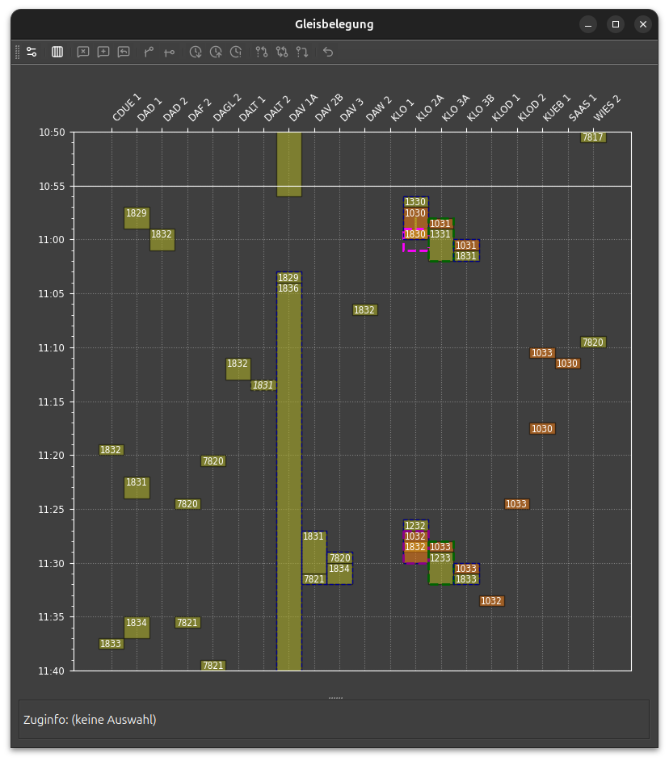
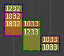
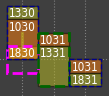

# Gleisbelegung

## Markierungen

- Gleisbelegung in Balkendarstellung.
    Der Balken erstreckt sich von Ankunfts- zu Abfahrtszeit (berücksichtigt also die Einfahrt und Ausfahrt nicht).
    Eine Linie zeigt die Ankunftsverspätung (max. 15 Minuten).
- Manöver:
    - Nummernwechsel (dunkelblauer, gestrichelter Rahmen)
    - Flügelung (dunkelgrüner, gestrichelter Rahmen)
    - Kupplung (gestrichelter Rahmen in Magenta):
        Bei planmässiger Ankunftsreihenfolge ist die Markierung dunkelmagenta.
        Wenn die Züge nicht planmässig ankommen (magenta), muss der Fdl dafür sorgen, dass sie in der richtigen Reihenfolge zum Kuppeln eintreffen.
    - Lokwechsel, Lokumlauf (dünner ausgezogener Rahmen in Magenta)
- Konflikte:
    - Gleiskonflikte (roter Rahmen): Der Sim meldet eine mögliche Doppelbelegung.
        Ein Gleiswechsel ist nötig, oder ein Zug muss aufgehalten werden.
        Bei Haltestellen mit gleichnamigen Gleisen ist die Warnung möglicherweise unbegründet.
        Der Fdl kann die Warnung nach einer Prüfung löschen.
    - Sektorkonflikte (oranger Rahmen): Züge, die in verschiedenen Sektoren einfahren, müssen entweder aus verschiedenen Richtungen, oder in der geplanten Reihenfolge einfahren.
        stsDispo kann nicht feststellen, ob dies zutrifft und zeigt in jedem Fall eine Warnung an.
        Der Fdl kann die Warnung nach einer Prüfung löschen.
- Gleissperrung (rote Schraffur):
    Gleissperrungen können im Hauptmenü _Einstellungen_ erfasst werden.
- Zuginfo: Für Zuginfo, Zug anklicken. Alle zur gleichen Markierung gehörenden Züge werden aufgelistet.

## Werkzeuge

- :bootstrap-actionUnbelegteGleise: Unbelegte Gleise anzeigen.
    Standardmässig werden nur Gleise angezeigt, die effektiv belegt sind.
- Markierungen
    - :bootstrap-actionWarnungSetzen: Konfliktmarkierung auf ausgewählte Balken setzen
    - :bootstrap-actionWarnungIgnorieren: ausgewählte Konfliktmarkierung löschen
    - :bootstrap-actionWarnungReset: Konfliktmarkierung auf ausgewählten Balken wiederherstellen 
- Disposition erfassen
    - :bootstrap-actionAnkunftAbwarten: [Ankunft abwarten (Anschluss abwarten)](dispo.md#ankunft-abwarten-anschluss-abwarten)
    - :bootstrap-actionAbfahrtAbwarten: [Abfahrt abwarten (Überholung)](dispo.md#abfahrt-abwarten-uberholung)
    - :bootstrap-actionKreuzung: [Gegenseitige Ankunft abwarten (Kreuzung)](dispo.md#zugkreuzung)
- Abfahrt einstellen
    - :bootstrap-actionBetriebshaltEinfuegen: [Betriebshalt einfügen](dispo.md#betriebshalt-einfugen)
    - :bootstrap-actionVorzeitigeAbfahrt: [Vorzeitige Abfahrt](dispo.md#vorzeitige-abfahrt)
    - :bootstrap-actionPlusEins:/:bootstrap-actionMinusEins: [Wartezeit verlängern/verkürzen](dispo.md#wartezeit-verlangernverkurzen)
- :bootstrap-actionLoeschen: [Befehl zurücknehmen](dispo.md#befehl-zurucknehmen)

Um eine Abhängigkeit zu setzen, müssen zwei Balken ausgewählt werden.
Der erste (Auswahl, gelb) markiert den wartenden Zug, der zweite (Referenz, hellblau) den abzuwartenden Zug.
Auf den Hintergrund klicken, um die Auswahl aufzuheben.

## Beispiel: Manöver

Die folgenden Ausschnitte[^1] zeigen die verschiedenen Manöver Nummernwechsel, Flügeln und Kuppeln.
Im ersten Fall verkehren alle Züge ohne Verspätung.
Der Fdl muss keine besonderen Vorkehrungen treffen.

- Der Zug 1033 führt einen Nummernwechsel zu 1833 durch.
- Der Zug 1033 teilt sich auf (flügeln). Der zweite Zug hat die Nummer 1233.
- Der Zug 1232 wechselt zuerst die Nummer zu 1032 und kuppelt dann mit dem später ankommenden 1832.

Wenn ein kuppelnder Zug verspätet ist, muss je nach örtlichen Gegebenheiten die Kupplungsreihenfolge beachtet werden.
Das Gleisbelegungsdiagramm zeigt eine Warnung in Magenta an:

## :bootstrap-actionSetup: Einstellungen

Auf der Einstellungsseite werden die dargestellten Gleise in einem Baumdiagramm ausgewählt.
Es können einzelne Gleise oder auch Bahnhofteile oder Bahnhöfe aus- oder abgewählt werden.

Nach erfolgter Auswahl, nochmal auf den :bootstrap-actionSetup:-Knopf klicken, um zur Grafik zurückzukehren. 

[^1]: Stellwerk Klosters (Ostschweiz)
