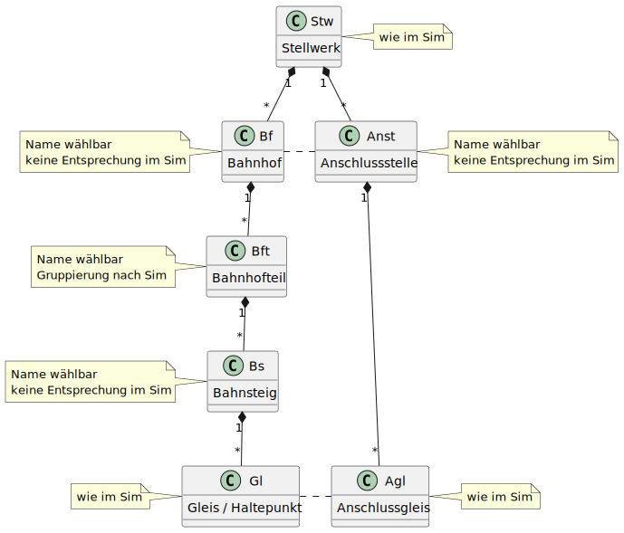

# Glossar

## Abkürzungen und Begriffe

Die folgende Tabelle listet die in STSdispo verwendeten Abkürzungen und Fachbegriffe auf.
Diese sind, soweit den Autoren bekannt, an das Original angelehnt.
Abweichungen können sich aber durch den internationalen Bezug und/oder das spezielle Design des Simulators ergeben.

!!! info
    Im Simulator gibt es nur Gleise und Anschlussgleise.
    Bahnhöfe und Bahnhofsnamen sind nur grafische Elemente auf dem Stellwerkstisch.

| Abkürzung |     Begriff      | Beschreibung                                                                                                                    |
|:---------:|:----------------:|:--------------------------------------------------------------------------------------------------------------------------------|
|    Agl    |  Anschlussgleis  | Name eines Gleises an dem Züge ein- und ausfahren können, inkl. Uebergabepunkte an andere Stellwerke. Vom Simulator vorgegeben. |
|   Anst    | Anschlussstelle  | Konfigurierbare Gruppe von Anschlussgleisen zum gleichen Ziel, z.B. Nachbarstellwerk.                                           |
|    Bf     |     Bahnhof      | Gruppe von benannten Gleisen am gleichen Ort                                                                                    |
|    Bft    |   Bahnhofteil    | Gruppe von Bahnsteigen, auf die ein Halt umdisponiert werden kann.                                                              |
|    Bs     |    Bahnsteig     | Konfigurierbare Gruppe von Gleisen, die an die gleiche Bahnsteigkante grenzen.                                                  |
|    Bst    |  Betriebsstelle  | Anschlussstelle oder Bahnhof                                                                                                    |
|    Fdl    | Fahrdienstleiter | Der/die Spieler/in                                                                                                              |
|    Gl     |      Gleis       | Benanntes Gleis (auch Gleissektor), das als Fahrziel eines Zuges dienen kann.                                                   |
|    Stw    |    Stellwerk     |                                                                                                                                 |

Über STS-spezifische Fachbegriffe gibt die [Stellwerksim]-Website Auskunft.

[Stellwerksim]: https://www.stellwerksim.de

## Bahnhofmodell

