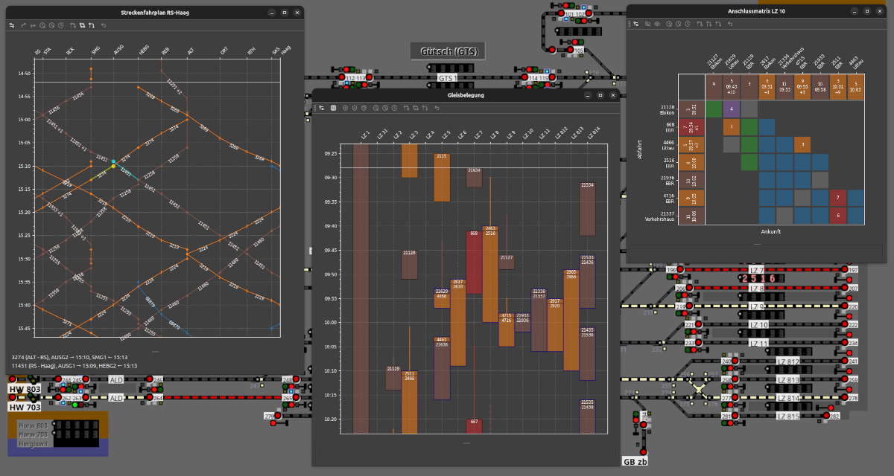

# STSdispo

_STSdispo_ ist ein Plugin zu [Stellwerksim].
Es bietet eine Reihe von grafischen Werkzeugen wie Bildfahrplan, Gleisbelegung und Anschlussmatrix, 
die dich beim Spiel unterstützen.
Es liest die Live-Daten des laufenden Spiels aus, stellt sie grafisch dar, und unterstützt dich bei der Disposition der Züge.
[Stellwerksim] ist ein kollaboratives, Online-Stellwerksimulatorspiel.

_STSkit_ enthält eine Implementierung der Stellwerksim Plugin-Schnittstelle in Python, die du auch für eigene Plugins verwenden kannst.

[Stellwerksim]: https://www.stellwerksim.de

## Hauptmerkmale

- Auswertung und Nachführung der aktuellen Betriebslage
    - Automatische Verspätungsprognose entlang der Zugketten mit Berücksichtigung der verschiedenen Betriebsvorgänge.
    - [Dispositionsjournal](dispo.md) mit Erfassung von Abhängigkeiten (Anschlüsse, Kreuzungen, Überholungen)
- [Grafischer Streckenfahrplan](streckenfahrplan.md)
- [Detaillierter Zugfahrplan](zugfahrplan.md)
- [Gleisbelegungsplan](gleisbelegung.md)
    - Warnung vor Gleis- und Sektorkonflikten
    - Hervorhebung von Manövern
- [Einfahrts- und Ausfahrtstabellen](ein-ausfahrten.md)
    - Abschätzung der effektiven Ein- und Ausfahrtszeiten
- [Anschlussmatrix](anschlussmatrix.md)
- [Rangierplan](rangierplan.md)
- Ereignisticker
- Asynchrone, objektorientierte Python-Schnittstelle für Stellwerksim-Plugins

Der Fokus des Projekts liegt auf der Auswertung von Fahrplandaten und der aktuellen Betriebslage, um eine möglichst reibungslose Disposition der Züge zu ermöglichen.
Verspätungen werden entlang der Zugketten hochgerechnet und können vom Fdl korrigiert werden.
