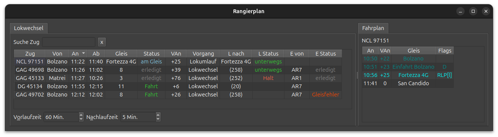

# Rangierplan

Der Rangierplan zeigt eine Tabelle von anstehenden und laufenden Lokwechseln und Lokumläufen an.
Die Zwecke des Rangierplans sind:

- Ersatzloks rechtzeitig (aber nicht zu früh) aufbieten
- Ueberblick über Fahrt und Halt rangierender Loks
- Erkennung von Fehlleitungen
- Beachtung der Abfertigungsreihenfolge

## Erläuterungen

| Spalte   | Funktion                                               | Details                                   |
|----------|--------------------------------------------------------|-------------------------------------------|
| Zug      | Zugnummer wie im Sim                                   |                                           |
| Von      | Herkunft (Einfahrgleis) des Zuges                      |                                           |
| An       | Ankunftszeit am Abfertigungsgleis inklusive Verspätung |                                           |
| Ab       | Planmässige Abfahrtszeit (ohne Verspätungsprognose)    |                                           |
| Gleis    | Disponiertes Gleis, an dem der Lokwechsel stattfindet  |                                           |
| Status   | Fahrstatus des Zuges                                   | Fahrt / Halt / am Gleis / erledigt        |
| VAn      | Ankunftsverspätung in Minuten                          |                                           |
| Vorgang  | Art des Rangiervorgangs                                | Lokumlauf oder Lokwechsel                 |
| L nach   | Fahrziel der abgekuppelten Lok                         |                                           |
| L Status | Fahrstatus der abgekuppelten Lok                       | unterwegs / Halt / erledigt               |
| E von    | Herkunft der Ersatzlok (bei Lokwechsel)                |                                           |
| E Status | Fahrstatus der Ersatzlok                               | unterwegs / Halt / Gleisfehler / erledigt |

### Herkunfts- und Zielgleise der Loks

Bei vielen Stellwerken haben Ausfahrgleise keinen Namen.
In diesen Fällen wird eine Nummer in Klammern angezeigt.
Diese Nummer entspricht _nicht_ einer Gleisnummer.
Eine automatische Zuordnung zu Gleisnummer ist in Arbeit.

### Automatische Richtungswechsel

Bei automatischen Richtungswechseln der Loks meldet der Sim keinen Fahrtstatus.
In diesem Fall kann der Fahrtstatus mit den Tasten L bzw. E zwischen Halt und unterwegs umgeschaltet werden.
Alternativ die Lok per Funk wenden lassen, warten, bis sie hält, und dann die Fahrstrasse stellen.

### Gleisfehler

Der Vermerk _Gleisfehler_ zeigt an, dass die Ersatzlok auf ein falsches Gleis disponiert wurde.
Das kann passieren, wenn der Zug auf ein anderes Gleis geleitet und das Zielgleis der Ersatzlok nicht angepasst wurde. 

## Einstellungen

Die Vorlauf- und Nachlaufzeiten werden direkt im Fenster eingestellt.
Sie bestimmen die Anzahl der angezeigten Züge.

Mit der Suchfunktion kann die Tabelle nach Zugnummer gefiltert werden.
