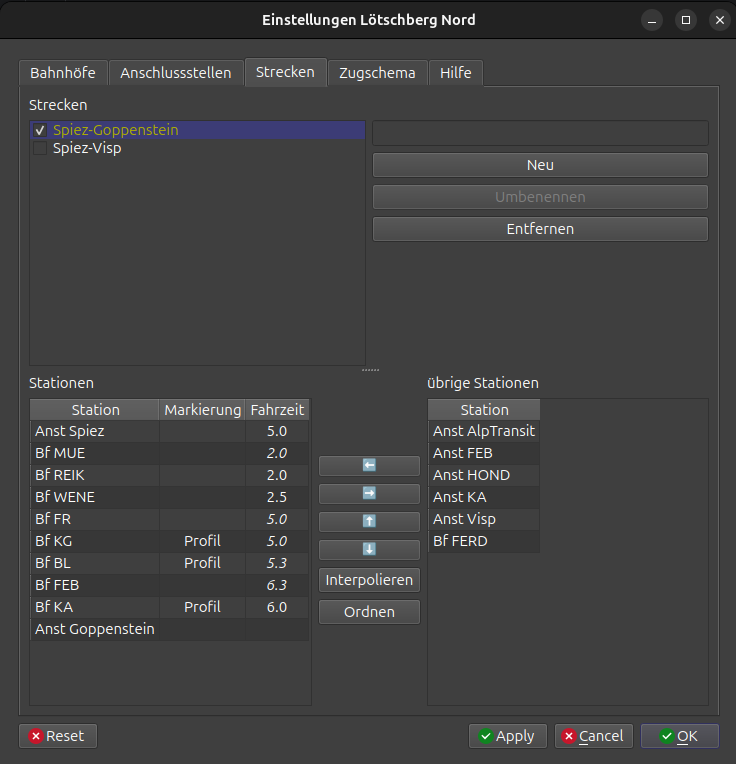
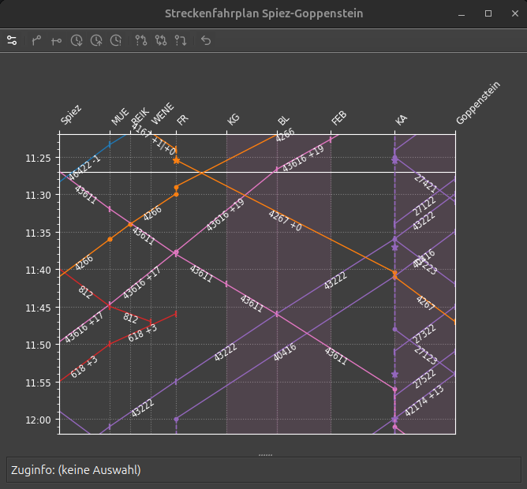

# Streckendefinition

Eine Strecke definiert eine Abfolge von Stationen (Anschlussstellen und Bahnhöfen),
die im Streckenfahrplan grafisch dargestellt werden kann.

stsDispo kennt automatisch und manuell erstellte Strecken.
Automatische Strecken werden anhand des Fahrplans erzeugt.
Es können jedoch Bahnhöfe fehlen, die zwar auf dem Stelltisch vorhanden sind aber von keinem Zug angefahren werden.
Bei Stellwerkupdates werden automatische Strecken angepasst.
Wenn eine automatische Strecke im Editor bearbeitet wird, wird sie zu einer manuellen Strecke.

Manuelle Strecken werden vom Spieler erstellt oder 
beim ersten Öffnen eines Stellwerks aus einer in der Distribution enthaltenen Beispielkonfiguration geladen.
Manuelle Strecken können besser auf die Bedürfnisse des Spielers angepasst werden,
können bei einem Stellwerkupdate jedoch fehlerhaft werden.

Eine (automatische oder manuelle) Strecke kann als _Hauptstrecke_ markiert werden.
Diese wird jeweils beim Öffnen des Streckenfahrplans dargestellt.

Strecken werden im [Einstellungsfenster](einstellungen.md) bearbeitet.
Die folgenden Bilder zeigen den Streckeneditor und den entsprechenden Bildfahrplan im Stellwerk Lötschberg Nord.

## Streckenliste

Die konfigurierten Strecken können in der Listbox ausgewählt werden.
Die Details der gewählten Strecke werden in der Tabelle links unten dargestellt.
Kursiv gesetzte Namen bezeichnen automatisch erstellte Strecken.
Mit den Knöpfen rechts können Strecken gelöscht, erstellt oder umbenannt werden.

Mit dem Auswahlfeld kann eine Hauptstrecke ausgewählt werden.
Diese wird beim Öffnen des Streckenfahrplans voreingestellt.
Es empfiehlt sich also, hier die am häufigsten benutzte Strecke zu markieren.

!!! tip
    - Es empfiehlt sich, möglichst wenige Strecken zu definieren.
        Viele der automatisch erstellten Strecken sind zu kurz und können gelöscht werden.
    - Da der Streckenfahrplan von links nach rechts dargestellt wird,
        sollte der Anfangspunkt eher links oben im Stellwerk liegen, der Endpunkt relativ dazu gesehen rechts unten.
    - Als Start- und Endpunkt können sowohl Anschlussstellen als auch Bahnhöfe verwendet werden.
        Anschlüsse können innerhalb der Strecke vorkommen, 
        je nach Konfiguration kann dies jedoch die Darstellung des Streckenfahrplans beeinträchtigen.
    - Etwas Experimentieren kann nötig sein.
        Wenn die gewählte Strecke in einem Streckenfahrplanfenster offen ist,
        wird der Streckenfahrplan nach dem Klicken von _Anwenden_ neu aufgebaut. 

### Neue Strecke erstellen

1. In den freien Bereich der Streckenliste klicken, so dass keine Strecke ausgewählt ist.
2. Neuen Streckennamen im Eingabefeld über den Knöpfen eingeben.
3. _Neu_-Knopf klicken.
4. Stationen in der Tabelle links unten erfassen (s. Streckeneditor)

## Streckeneditor

Die Boxen unten zeigen zwei Listen mit Stationen (Bahnhöfen und Anschlussstellen).
Die linke Liste zeigt die aktuell bearbeitete Strecke,
die rechte Liste enthält die von der Strecke unberührten Stationen.

### Stationen hinzufügen und entfernen

Stationen werden zur Strecke hinzugefügt, indem sie durch Klicken und Ziehen oder mittels des _Links_-Knopfs
von der rechten in die linke Liste verschoben werden.

Stationen werden von der Strecke entfernt, indem sie durch Klicken und Ziehen oder mittels des _Rechts_-Knopfs
von der linken in die rechte Liste verschoben werden.

Wenn die Strecke zwei Stationen (Anfang und Ende) enthält,
kann der _Interpolieren_-Knopf verwendet werden, um die dazwischen liegenden Stationen aus dem Fahrplan zu bestimmen.
Weil der bei dieser Funktionen benutzte Algorithmus auf dem Fahrplan beruht, fehlen oft nicht angefahrene Stationen. 
Diese muss der Spieler gemäss ihrer Lage auf dem Stelltisch von Hand hinzufügen.

### Stationen anordnen

Stationen werden innerhalb der Strecke verschoben durch Klicken und Ziehen oder mittels der _Hoch/Runter_-Knöpfe.

Mit dem _Ordnen_-Knopf wird die Strecke automatisch geordnet.
Die automatische Anordnung basiert auf der Abfolge in den Zugfahrplänen.
In gewissen Konstellationen kann die Anordnung nicht automatisch bestimmt werden.

### Fahrzeiten

Die Fahrzeiten zwischen zwei Stationen werden in der Regel automatisch aus dem Fahrplan berechnet.
Bei Ein- und Ausfahrten und Stellen, wo dies nicht möglich ist, nimmt stsDispo eine Defaultwert von 1 Minute an.
Die von stsDispo berechneten Werte sind in der Tabelle kursiv dargestellt.
Die Fahrzeiten sind in Minuten angegeben.

Der Spieler kann die Fahrzeiten in der Tabelle anpassen.
Es empfiehlt sich, dies nur für Ein- und Ausfahrten, sowie fehlende Werte zu tun.
Manuell bearbeitete Fahrzeiten werden vom Programm nicht mehr geändert,
auch wenn sich der Fahrplan aus irgendeinem Grund geändert hat (z.B. Tageszeit, Szenario, Umbau). 

Zum Bearbeiten auf einen Wert doppelklicken, den Wert ändern und die Eingabetaste drücken.

!!! info
    Die Pluginschnittstelle gibt keine Einfahrts- und Ausfahrtszeiten bzw. Fahrzeiten von und zu den Anschlüssen bekannt.
    stsDispo misst zwar die Fahrzeiten der Züge im Lauf des Spiels.
    Es kann aber nützlich sein, hier manuelle Werte einzusetzen, insbesondere wenn die Fahrzeiten deutlich länger als eine Minute sind.

### Streckenmarkierung

Einzelne Streckenabschnitte können im Streckenfahrplan farblich unterlegt werden,
um wichtige Beschränkungen auf der Strecke anzuzeigen.
stsDispo unterstützt folgende Arten der Beschränkungen:

| Art       | Farbe | Beschreibung                              | Beispiele                           |
|-----------|-------|-------------------------------------------|-------------------------------------|
| Gefahrgut | rot   | Einschränkungen für Gefahrguttransporte   | Unterseetunnel in Dänemark          |
| Gleis     | grau  | Reduzierte Gleiskapazität                 | Eingleisige Strecken, Gleissperrung |
| Profil    | rosa  | Einschränkungen für Züge mit Sonderprofil | SIM-Züge am Lötschberg              |
| Traktion  | blau  | Einschränkungen nach Traktion             | Nicht elektrifizierte Strecken      |

Die Streckenmarkierung wird über die aufklappbare Liste in der Tabelle ausgewählt.
