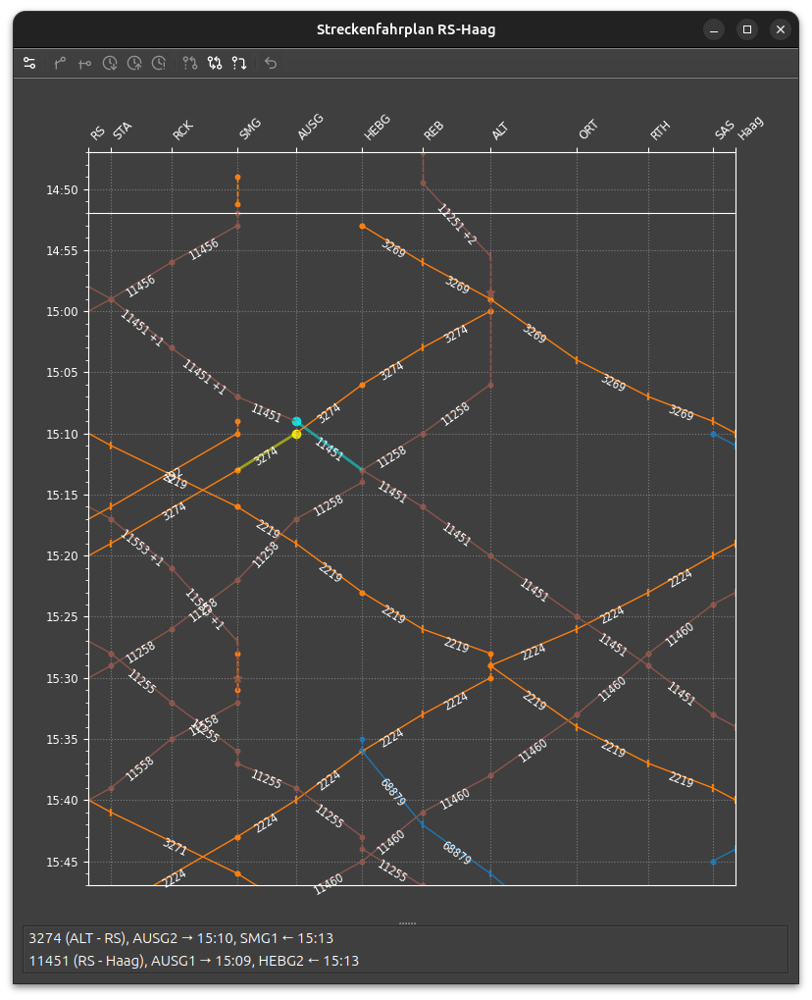

# Streckenfahrplan

Der Streckenfahrplan oder Bildfahrplan zeigt die Zugläufe in einem Weg-Zeit-Diagramm an.

## Markierungen

- Ausgezogene Linie: Fahrten zwischen Bahnhöfen (_Trasse_)
- Gestrichelte Linie: Wartezeiten und Rangierfahrten innerhalb eines Bahnhofs
- Kreis: Planmässiger Halt
- Senkrechter Strich: Planmässige Durchfahrt
- Stern: Manöver (Flügeln/Kuppeln/Nummernwechsel)
- Kreuz: Betriebshalt
- Dreieck nach unten: Abhängigkeit aus Disposition

## Werkzeuge

Durch Anklicken wird eine Trasse und der nächste Bahnhof ausgewählt.
Es können bis zu zwei Trassen ausgewählt sein.
Die Auswahl wird durch Klicken auf den Hintergrund gelöscht.
Auf die gewählten Trassen können folgende Aktionen aus der Werkzeugleiste angewendet werden.

- Disposition erfassen
    - :bootstrap-actionAnkunftAbwarten: [Ankunft abwarten (Anschluss abwarten)](dispo.md#ankunft-abwarten-anschluss-abwarten)
    - :bootstrap-actionAbfahrtAbwarten: [Abfahrt abwarten (Überholung)](dispo.md#abfahrt-abwarten-uberholung)
    - :bootstrap-actionKreuzung: [Gegenseitige Ankunft abwarten (Kreuzung)](dispo.md#zugkreuzung)
- Abfahrt einstellen
    - :bootstrap-actionBetriebshaltEinfuegen: [Betriebshalt einfügen](dispo.md#betriebshalt-einfugen)
    - :bootstrap-actionVorzeitigeAbfahrt: [Vorzeitige Abfahrt](dispo.md#vorzeitige-abfahrt)
    - :bootstrap-actionPlusEins:/:bootstrap-actionMinusEins: [Wartezeit verlängern/verkürzen](dispo.md#wartezeit-verlangernverkurzen)
- :bootstrap-actionLoeschen: [Befehl zurücknehmen](dispo.md#befehl-zurucknehmen)

Um eine Abhängigkeit zu setzen, müssen zwei Trassen ausgewählt werden.
Die erste (Auswahl, gelb) markiert den wartenden Zug, die zweite (Referenz, hellblau) den abzuwartenden Zug.

## :bootstrap-actionSetup: Einstellungen

Die dargestellte Strecke wird auf der Einstellungsseite ausgewählt.
Es gibt zwei Arten, die Strecke auszuwählen:

### Vordefinierte Strecke aus der Anlagenkonfiguration

Strecken können in Modul Einstellungen manuell definiert und mit einem beliebigen Namen versehen werden.
Die Namen werden in der Auswahlbox aufgeführt.

Beim ersten Start eines Stellwerks werden automatisch alle Strecken zwischen den verschiedenen Ein- und Ausfahrten hinzugefügt.
Diese entsprechen der automatischen Streckenwahl (s.u.) und sind möglicherweise nicht sinnvoll.
In diesen Fällen muss die Konfiguration manuell bearbeitet werden.

### Anfangs- und Endpunkt

Um diese Methode zu verwenden, darf keine vordefinierte Strecke ausgewählt sein.

Bei Auswahl eines Anfangs- und Endpunkts sucht das Programm den kürzesten Weg und schliesst die auf dem Weg liegenden Bahnhöfe ein.
Dabei können je nach Stellwerk auch unerwartete Ergebnisse auftreten.
In manchen Fällen hilft es, zusätzlich einen Via-Bahnhof auszuwählen.

Bei Stellwerken, in denen Züge über zwei verschiedene Anlageteile wie z.B. Neubau- und Altbaustrecken geleitet werden können,
sind in beiden Anlageteilen oft unsichtbare, gemeinsame Bahnsteige eingebaut.
Das Plugin hat keine Möglichkeit festzustellen, ob zwischen den Anlageteilen effektiv eine Gleisverbindung besteht.
In diesen Fällen versagt der Algorithmus.
Die Strecke muss manuell konfiguriert werden.

Die Teilstrecken Anfang-Via und Via-Ende können über die gleichen Bahnhöfe führen.
Das kann bei Kopfbahnhöfen sinnvoll sein.
Es ist jedoch möglich, dass Züge teilweise in der Darstellung fehlen.
In diesem Fall ist es besser, ein zweites Fenster mit der zweiten Strecke zu öffnen.

## Bemerkungen

Die Abstände auf der Wegachse werden nach Möglichkeit anhand der fahrplanmässigen Fahrzeiten zwischen den Bahnhöfen bestimmt.
Diese Bestimmung schlägt fehl, wenn keine an den Punkten haltenden Züge im Fahrplan enthalten sind, oder wenn der Fahrweg nicht eindeutig bestimmt werden kann.

Ausserdem kann die Bestimmung ungenau sein, wenn Züge im Fahrplan grosszüge oder stark richtungsabhängige Fahrzeitreserven haben.

Wenn mehrere Haltepunkte an einer Fahrstrasse liegen, hat das Plugin u. U. keine Möglichkeit, die Reihenfolge der Haltepunkte festzustellen.
