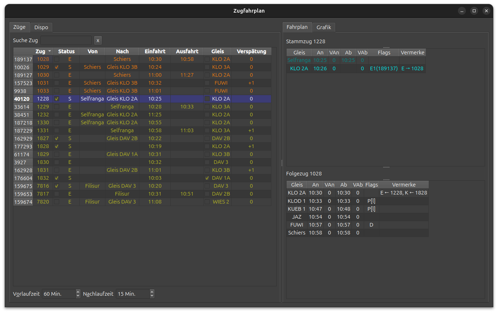
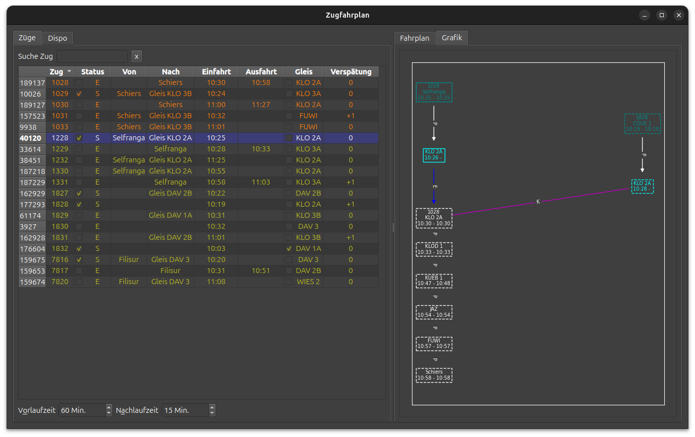

# Zugfahrplan

Im Zugfahrplan können die Fahrplandetails und die aktuelle Betriebslage der Züge eingesehen werden.

Auf der linken Seite werden alle bekannten Züge aufgelistet.
Das Zeitfenster kann durch die Einstellungen _Vorlaufzeit_ und _Nachlaufzeit_ angepasst werden.
Durch Klicken auf einen Spaltentitel wird die Liste sortiert.
Durch die Eingabe einer Zugnummer im Suchfeld wird die Liste gefiltert.

Durch Klicken auf einen Zug wird sein Fahrplan auf der rechten Seite eingeblendet.
Falls vorhanden, wird zudem der Fahrplan des Folgezugs eingeblendet.
Die Darstellung des Zugfahrplans kann tabellarisch (Screenshot oben) oder grafisch (Screenshot unten) erfolgen.

## Zugliste

Die Zugliste auf der linken Seite zeigt folgende Informationen:

| Spalte     | Funktion                                | Details                                                                                                                  |
|------------|-----------------------------------------|--------------------------------------------------------------------------------------------------------------------------|
| zid        | Sim-interne Zugsnummer                  | Für den Benutzer normalerweise nicht sichtbar                                                                            |                                                      
| Zug        | Gattung und Nummer wie im Simulator     |                                                                                                                          |
| Status     | Sichtbarkeitsstatus                     | :lucide-square: E: noch nicht eingefahren   :lucide-square-check: S: im Stellwerk   :lucide-square: A: ausgefahren |
| Von        | Herkunft (Einfahrtsgleis)               |                                                                                                                          |
| Nach       | Endziel (Ausfahrtsgleis)                |                                                                                                                          |
| Einfahrt   | Erwartete oder gemessene Einfahrtszeit  | (s. [Modul Ein-/Ausfahrten](ein-ausfahrten.md))                                                                          |
| Ausfahrt   | Erwartete oder gemessene Ausfahrtszeit  | (s. [Modul Ein-/Ausfahrten](ein-ausfahrten.md))                                                                          |
| Gleis      | Aktuelles Fahrziel (disponiertes Gleis) | :lucide-square-check:: Zug ist am Gleis                                                                                  |
| Verspätung | Aktuelle Verspätung                     |                                                                                                                          |

## Zugfahrplan, Tabellenansicht

Ein Hauptunterschied zum Zugfahrplan im Simulator ist, 
dass Einfahrt und Ausfahrt eine eigene Zeile mit der von STSdispo berechneten Einfahrts- bzw. Ausfahrtszeit haben

Bei sichtbaren Zügen wird das aktuelle Fahrplanziel cyan hervorgehoben.
Erledigte Fahrplaneinträge erscheinen dunkelcyan.
Angeordnete Betriebshalte werden orange markiert.[^1]

[^1]: Das Feature Betriebshalte ist noch in Entwicklung. 
    Betriebshalte werden im Fahrplan angezeigt.
    Das Erreichen der Betriebshalte wird jedoch noch nicht erkannt.

Der Zugfahrplan zeigt neben den geläufigen Informationen auch interne Informationen vom Simulator, 
die eher für fortgeschrittene Anwender gedacht sind.

| Spalte   | Funktion                                  | Details                                                                                                                                  |
|----------|-------------------------------------------|------------------------------------------------------------------------------------------------------------------------------------------|
| Gleis    | Disponiertes Gleis                        | Bei Gleisänderung erscheint das Plangleis zwischen Schrägstrichen                                                                        |
| An       | Geplante Ankunftszeit                     |                                                                                                                                          |
| Ab       | Geplante Abfahrtszeit                     |                                                                                                                                          |
| VAn      | Geschätzte Ankunftsverspätung             | Bei erledigten Zielen die effektive Verspätung                                                                                           |
| VAb      | Geschätzte Abfahrtsverspätung             | Bei erledigten Zielen die effektive Verspätung                                                                                           |
| Flags    | Vom Erbauer definierte Betriebsvorgänge   | Uebersicht: s. Tabelle unten; Details: s. [Erbauerhandbuch](https://doku.stellwerksim.de/doku.php?id=stellwerksim:erbauer:zugbau:flags)) |
| Vermerke | Ersatz, Kupplung, Flügelung, Betriebshalt | Mit Nummer des Gegenzugs                                                                                                                 |

### Flags

| Flag | Funktion                                         |
|------|--------------------------------------------------|
| A    | Vorzeitige Abfahrt möglich                       |
| D    | Durchfahrt                                       |
| E    | Ersatz/Nummernwechsel                            |
| F    | Flügeln                                          |
| K    | Kuppeln                                          |
| L    | Lokumlauf                                        |
| P    | Startaufstellung (keine Bedeutung in STSdispo)   |
| R    | Richtungsänderung (keine Bedeutung in STSdispo)  |
| W    | Lokwechsel                                       |

## Zugfahrplan, Graphansicht

In der Graphansicht wird jedes Fahrplanziel als Kasten mit dem disponierten Gleis und der planmässigen Aufenthaltszeit dargestellt.
Der oberste Kasten enthält zudem die Zugnummer.

Die Kasten sind vertikal zeitlich geordnet und in der Reihenfolge des Fahrplans durch Pfeile verbunden.
Ein Buchstabe bezeichnet den Typ der Relation:

| Kantentyp | Funktion                   |
|-----------|----------------------------|
| P         | Planmässige Fahrt          |
| E         | Ersatz/Nummernwechsel      |
| F         | Flügeln                    |
| K         | Kuppeln                    |

!!! Example "Beispiel"

    Der Beispiel-Screenshot zeigt grafisch, dass Zug 1228 als erster in KLO 2A einfährt.
    Im Bahnhof Klosters kuppeln die Züge bei umgekehrter Reihenfolge nicht.
